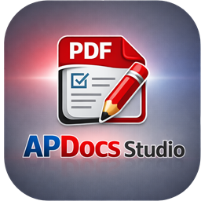

<div align="center">



# APDocs Studio

The most powerful photo & PDF editor for Windows.
Edit images with Paint, extract text with OCR, and export flawless PDFs — all in one free app.

[](#license)
[](#)
[](#)
[](https://github.com/atharvpawar16/APDocsStudio)
[](https://apdocsstudio.netlify.app)

[Features](#features) · [Paint Guide](#paint-integration-guide) · [Getting Started](#getting-started) · [Shortcuts](#keyboard-shortcuts) · [Website](https://apdocsstudio.netlify.app)

</div>

---

## What is APDocs Studio?

APDocs Studio is a professional-grade photo and PDF editing suite built for Windows. It brings together everything you need to work with documents and images — deep image editing, Tesseract-powered OCR, PDF import/export, and a unique Microsoft Paint integration that lets you use Paint's Select & Cut tools for pixel-perfect edits.

No subscriptions. No cloud. No bloat. Just a fast, capable desktop app that runs entirely on your machine.

---

## Features

### Photo Editing
| Feature | Description |
|---|---|
| Brightness & Contrast | Fine-tune exposure and tonal range on any image |
| Saturation & Hue | Correct color casts and shift hues precisely |
| Sharpness | Enhance detail with adjustable sharpening |
| Crop & Rotate | Trim edges, fix orientation, flip pages |
| Auto Deskew | Straighten tilted scans with one click |
| Black & White | Convert to grayscale or true black & white |
| Blank Page Detection | Automatically remove empty pages from batches |

### PDF Tools
| Feature | Description |
|---|---|
| PDF Import | Open any existing PDF and edit page by page |
| PDF Export | Save as standard or searchable PDF |
| Merge | Combine multiple images into a single PDF |
| Page Reorder | Drag and drop pages into any order |
| Compression Control | Balance file size vs. image quality |
| OCR Text Layer | Embed invisible searchable text into exported PDFs |

### Paint Integration
The only editor that lets you open any image directly in Microsoft Paint for precision editing using Paint's native Select & Cut tools. Changes sync back to APDocs Studio automatically.

### OCR — Text Extraction
Powered by Tesseract, one of the most accurate open-source OCR engines available. Extract text from any image in 40+ languages and create fully searchable, copy-pasteable PDFs.

---

## Paint Integration Guide

> Microsoft Paint is built into every Windows PC. APDocs Studio uses it as a precision editing tool.

### Rectangular Select & Cut
```
1. Right-click a page in APDocs Studio → Edit with Paint
2. In Paint's Home tab, click Select → Rectangular selection
3. Draw a box around the area you want to remove
4. Press Delete or Ctrl+X to cut it out (fills with white)
5. Press Ctrl+S to save — APDocs Studio reloads it instantly
```

### Free-form Select
```
1. Click Select → Free-form selection
2. Draw around the exact shape you want to keep
3. Ctrl+C → Ctrl+N → Ctrl+V to paste onto a clean canvas
4. Save → export as PDF from APDocs Studio
```

### Remove a Watermark or Stamp
```
1. Right-click Color 2 in Paint → set to white
2. Use Rectangular Select to box the watermark
3. Press Delete — it fills with white
4. Ctrl+S → clean PDF export in APDocs Studio
```

### Crop to a Specific Region
```
1. Draw a Rectangular selection around the region to keep
2. Click Image → Crop (or Ctrl+Shift+X on Windows 11)
3. Ctrl+S → APDocs Studio picks up the cropped image
```

---

## Getting Started

### Requirements

- Windows 10 / 11 (64-bit)
- [.NET 9 Runtime](https://dotnet.microsoft.com/en-us/download/dotnet/9.0)
- Microsoft Paint (pre-installed on all Windows PCs)

### Build from Source

```bash
git clone https://github.com/atharvpawar16/APDocsStudio.git
cd APDocsStudio
dotnet build APDocsStudio.sln
dotnet run --project APDocsStudio.csproj
```

---

## Keyboard Shortcuts

| Action | Shortcut |
|---|---|
| Save as PDF | `Ctrl + S` |
| Save as Image | `Ctrl + I` |
| Import File | `Ctrl + O` |
| Run OCR | `Ctrl + Alt + O` |
| Batch Process | `Ctrl + B` |
| Rotate Left | `Ctrl + Shift + ←` |
| Rotate Right | `Ctrl + Shift + →` |
| Email PDF | `Ctrl + E` |
| Print | `Ctrl + P` |
| Zoom In | `Ctrl + +` |
| Zoom Out | `Ctrl + -` |
| Undo | `Ctrl + Z` |

---

## Tech Stack

| Layer | Technology |
|---|---|
| Language | C# 12 |
| Runtime | .NET 9 |
| UI Framework | Eto.Forms + WinForms |
| Dependency Injection | Autofac |
| OCR Engine | Tesseract |
| PDF Processing | PdfSharp + Pdfium |
| Image Processing | GDI+ / System.Drawing |
| Logging | NLog |
| IPC | gRPC / Protobuf |
| Serialization | Newtonsoft.Json |
| Barcode Detection | ZXing.Net |
| External Editor | Microsoft Paint |

---

## Open Source Attribution

APDocs Studio is built on top of several open-source libraries. In accordance with their licenses, the following attributions are required:

- [NAPS2](https://github.com/cyanfish/naps2) — Core document processing, image pipeline, OCR integration, and PDF engine. Licensed under [GPL-2.0](https://github.com/cyanfish/naps2/blob/master/LICENSE). Copyright © NAPS2 Contributors.

APDocs Studio itself is also distributed under the GPL-2.0 license in compliance with the above. See [`LICENSE`](./LICENSE) for full terms.

> As required by GPL-2.0: the source code of APDocs Studio is publicly available in this repository. Any modifications made to GPL-licensed components are included here.

---

<div align="center">

Made with ❤️ by [Atharv Pawar](https://github.com/atharvpawar16)

If you find this useful, consider starring the repo!

</div>
